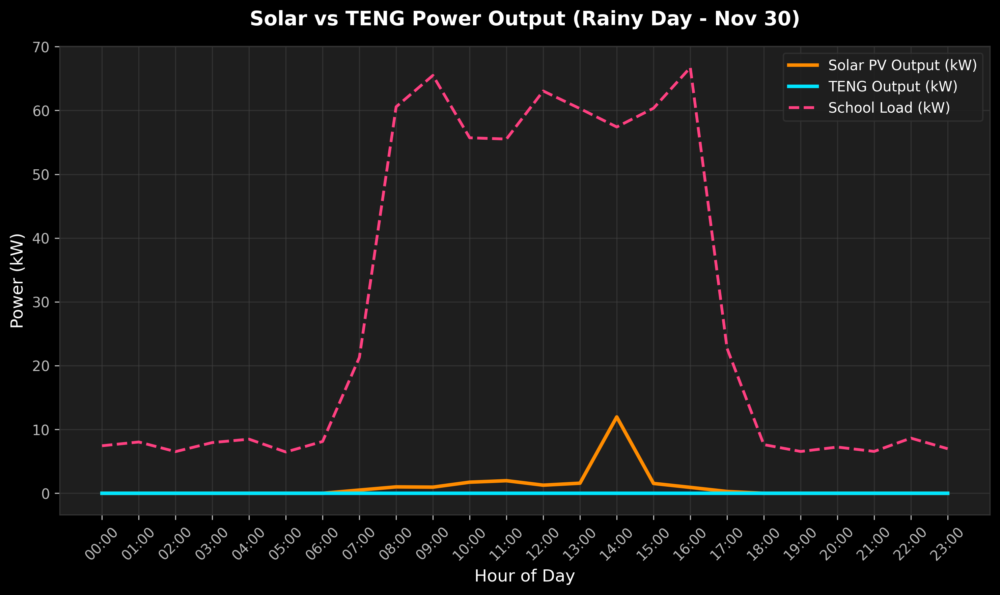
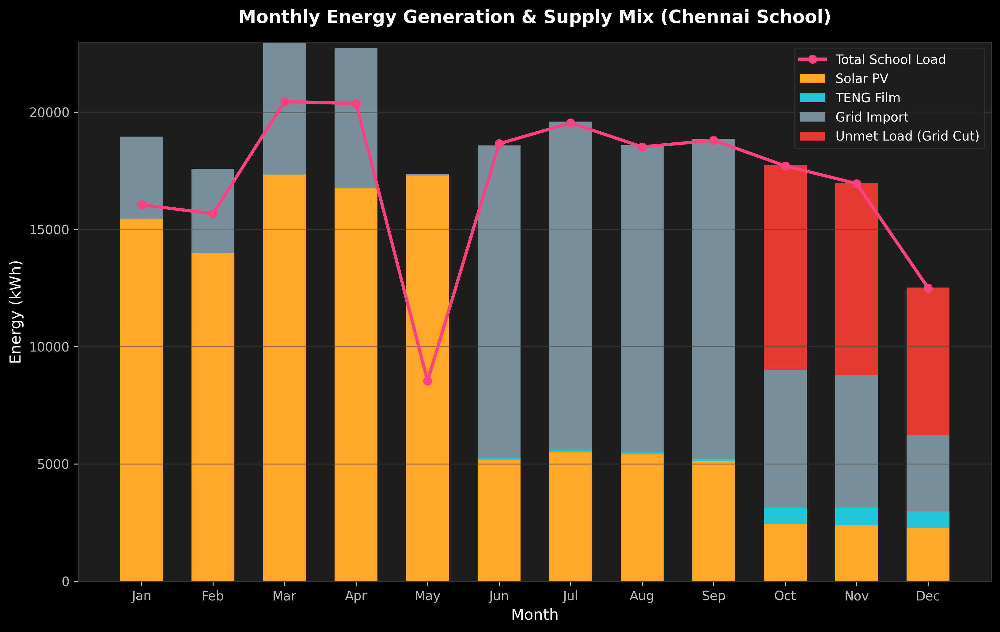
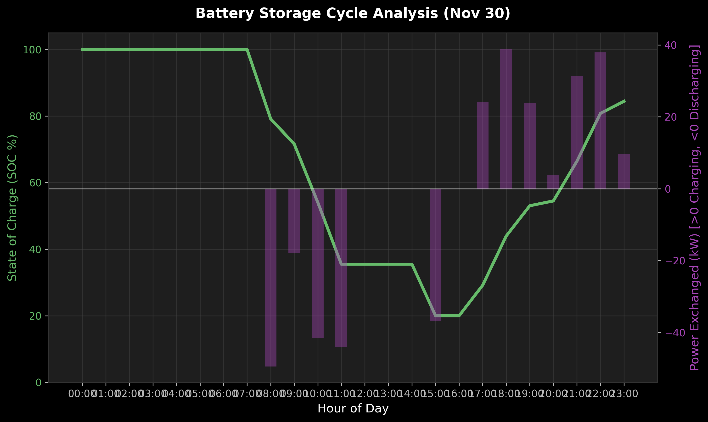
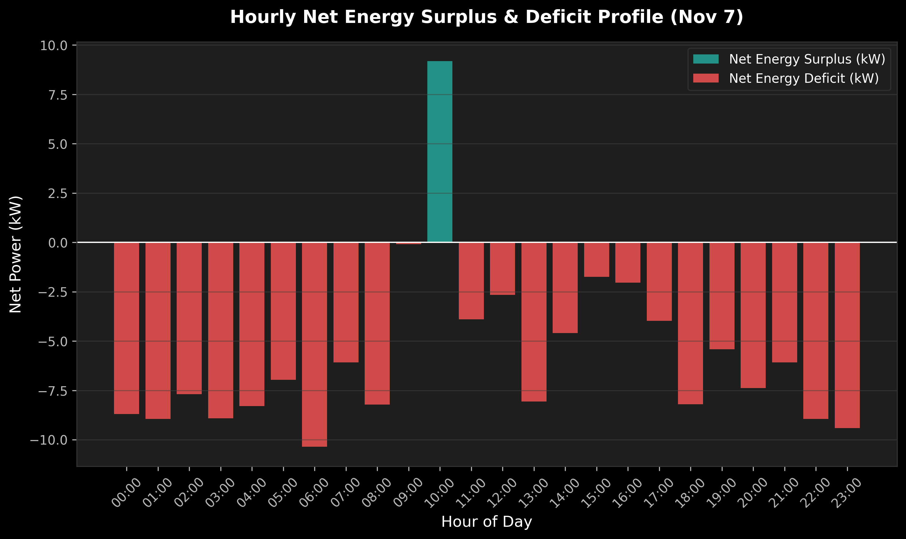
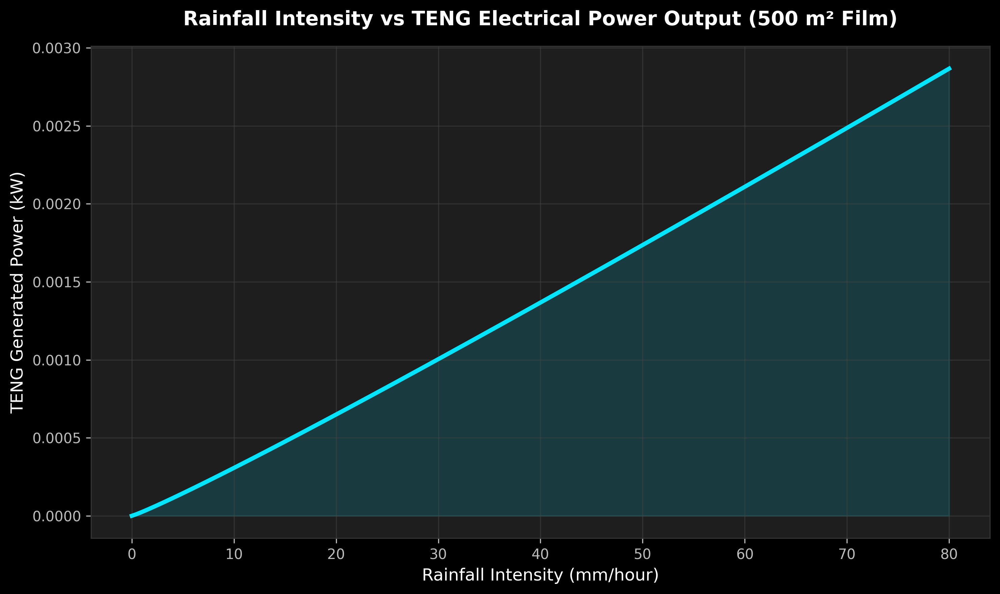

# ⚡ Chennai Solar-TENG Hybrid Renewable Energy System (HRES) Simulation

<p align="center">
  
  
</p>

<p align="center">
  
  
  
  
  
</p>

---

## 📌 Project Overview

This project simulates a **Hybrid Renewable Energy System (HRES)** combining:

- 🌞 **Solar Photovoltaic (PV) Panels** — 500 m² array on a school rooftop
- 💧 **Triboelectric Nanogenerator (TENG) Film** — 500 m² laminate overlaid on PV panels, harvesting kinetic energy from raindrops
- 🔋 **250 kWh Lithium-ion Battery Storage** — buffers supply and demand imbalances
- 🤖 **LSTM Neural Network** — forecasts hourly school energy demand and optimally dispatches energy

The system is specifically designed for a **school campus in Chennai, Tamil Nadu, India**, which faces:
- High solar irradiance in summer (up to 1000 W/m²)
- Heavy cyclonic rainfall during the **Northeast Monsoon (Oct–Dec)** with up to 80 mm/h rainfall
- Severe **grid power cuts** during monsoon storms, when solar PV drops by 90%

The TENG film fills this critical gap — generating electricity from the very rainfall that disrupts the grid.

---

## 🌦️ Chennai Climate Model (4 Seasons)

| Season | Months | Solar Irradiance | Temperature | Rainfall | Grid Outages |
|---|---|---|---|---|---|
| ☀️ Summer | Mar – May | 900–1000 W/m² | 35–42 °C | None | Rare |
| 🌧️ SW Monsoon | Jun – Sep | 200–400 W/m² | 28–34 °C | 5–30 mm/h | Occasional |
| ⛈️ NE Monsoon | Oct – Dec | 100–250 W/m² | 24–30 °C | 10–80 mm/h | **Severe** |
| 🌤️ Winter | Jan – Feb | 700–900 W/m² | 22–28 °C | Minimal | Rare |

---

## 🔬 Physical Models

### Solar PV Power

$$P_{pv} = A_{pv} \cdot \eta_{pv} \cdot \tau_{teng} \cdot \frac{G}{1000} \cdot \left[1 - \beta (T_{cell} - T_{ref})\right]$$

where the cell temperature is:

$$T_{cell} = T_{amb} + G \cdot \frac{NOCT - 20}{800}$$

| Parameter | Value |
|---|---|
| Panel Area ($A_{pv}$) | 500 m² |
| Panel Efficiency ($\eta_{pv}$) | 20% |
| TENG Transmittance ($\tau_{teng}$) | 90% |
| Temp. Coefficient ($\beta$) | 0.004 /°C |
| NOCT | 45 °C |

---

### Raindrop TENG Power

The TENG film harvests kinetic energy from falling raindrops. Using the Marshall–Palmer drop-size distribution:

$$d = 2.23 \times 10^{-3} \cdot R^{0.102}$$

$$v = 9.58 \cdot \left(1 - e^{-d_{mm}/1.77}\right)$$

$$E_k = \frac{1}{2} \cdot \rho_w \cdot \frac{\pi d^3}{6} \cdot v^2$$

$$P_{teng} = A_{teng} \cdot N \cdot E_k \cdot \eta_{teng} \cdot k_{amp} \times 10^{-3}$$

| Parameter | Value |
|---|---|
| TENG Area ($A_{teng}$) | 500 m² |
| TENG Efficiency ($\eta_{teng}$) | 2.5% |
| Water Density ($\rho_w$) | 1000 kg/m³ |
| Max Rainfall (Chennai cyclone) | 80 mm/h |

---

### Battery Storage Model

| Parameter | Value |
|---|---|
| Capacity | 250 kWh |
| Min SOC | 20% |
| Max SOC | 100% |
| Charge/Discharge Efficiency | 95% |
| Max Rate | 60 kW |

**Charging** (when generation > load):

$$E_{bat}(t) = E_{bat}(t-1) + \min(P_{excess}, P_{ch,max}) \cdot \eta_{ch} \cdot \Delta t$$

**Discharging** (when generation < load):

$$E_{bat}(t) = E_{bat}(t-1) - \frac{\min(P_{deficit}, P_{dis,max})}{\eta_{dis}} \cdot \Delta t$$

---

## 🤖 AI Load Forecaster (LSTM)

An **LSTM Neural Network** (TensorFlow / Keras) is trained on 8,760 hours of school load data to predict hourly energy demand.

**Architecture:**
```
Input (24 timesteps × 8 features)
    → LSTM(50 units, return_sequences=True)
    → Dropout(0.1)
    → LSTM(30 units)
    → Dropout(0.1)
    → Dense(20, ReLU)
    → Dense(1) — predicted load (kW)
```

**Input Features:**
- School load (past 24 hrs)
- Ambient temperature
- Solar irradiance
- Rainfall rate
- Hour of day (sin/cos encoded)
- Day of week (sin/cos encoded)

**Results:**

| Metric | Value |
|---|---|
| Train MAE | 2.99 kW |
| **Test MAE** | **3.00 kW** |
| Test RMSE | 5.51 kW |

---

## 📊 Simulation Results

### Annual KPIs

| KPI | Value |
|---|---|
| Total Annual School Load | 203,751.85 kWh |
| Solar Energy Generated | 109,135.21 kWh |
| TENG Energy Generated | 2,499.88 kWh |
| **Total Renewable Energy** | **111,635.09 kWh** |
| Grid Import Required | 87,678.63 kWh |
| Unmet Load (Outages) | 23,163.90 kWh |
| **Renewable Energy Fraction** | **45.60%** |
| **CO₂ Saved vs Diesel** | **74.33 tonnes/year** |
| **System Efficiency** | **83.23%** |
| **Annual Cost Savings** | **₹7,43,274.51** |

---

## 📈 Generated Graphs (300 DPI)

<p align="center"><b>Graph 1 — Solar vs TENG Output on a Heavy Rain Day (Nov 7)</b></p>
<p align="center"></p>

<p align="center"><b>Graph 2 — Monthly Energy Generation Comparison</b></p>
<p align="center"></p>

<p align="center"><b>Graph 3 — Battery SOC & Charge/Discharge Cycle</b></p>
<p align="center"></p>

<p align="center"><b>Graph 4 — Hourly Energy Surplus & Deficit</b></p>
<p align="center"></p>

<p align="center"><b>Graph 5 — Rainfall Intensity vs TENG Power Output Curve</b></p>
<p align="center"></p>

---

## 🗂️ Project Structure

```
hres_simulation/
│
├── data_generator.py     # Chennai 4-season climate & school load data (8760 hrs)
├── models.py             # Solar PV, Raindrop TENG & Battery physics models
├── lstm_forecaster.py    # LSTM neural network for hourly AI load forecasting
├── simulation.py         # Hourly dispatch loop, AI controller & KPI calculator
├── run.py                # Master runner: trains LSTM, runs sim, exports graphs
│
└── plots/                # Auto-generated high-resolution PNG outputs (300 DPI)
    ├── 1_solar_vs_teng_24h.png
    ├── 2_monthly_energy_comparison.png
    ├── 3_battery_charge_level.png
    ├── 4_energy_surplus_deficit.png
    └── 5_rainfall_vs_teng_curve.png
```

---

## 🚀 Getting Started

### Prerequisites

```bash
pip install numpy pandas matplotlib tensorflow scikit-learn
```

### Run the Simulation

```bash
git clone https://github.com/YOUR_USERNAME/chennai-hres-solar-teng.git
cd chennai-hres-solar-teng
python run.py
```

The script will:
1. Generate the full year of Chennai climate + school load data
2. Train the LSTM load forecasting model
3. Run the 8,760-hour HRES dispatch simulation
4. Print the performance KPI table
5. Export all 5 graphs as 300 DPI PNG files to the `plots/` folder

Expected runtime: **~5–10 minutes** (dominated by LSTM training)

---

## 🏫 System Design Rationale

Chennai's Northeast Monsoon (Oct–Dec) presents a unique dual challenge:
- **Grid fails** due to flooding and storm damage
- **Solar fails** because thick cloud cover blocks 90% of irradiance

The **TENG film laminated on the PV panels** converts the same raindrop kinetic energy that is causing the grid failure into usable electricity. This makes the HRES **self-reinforcing during the worst power-cut conditions** — when rain is heaviest, TENG output is highest, and the battery can stay charged to supply the school through outages.

The **AI controller** detects upcoming monsoon grid-cut risk via the LSTM forecast and proactively preserves battery SOC above 40% by temporarily importing cheaper grid power before an outage strikes — minimizing unmet load and blackout hours.

---

## 📜 License

This project is licensed under the MIT License — see the [LICENSE](LICENSE) file for details.

---

## 👨‍🔬 Author

Built as a competition entry demonstrating the potential of hybrid nanogenerator systems for energy-resilient school infrastructure in climate-vulnerable urban areas of India.

> *"When it rains in Chennai, the school stays powered."*
